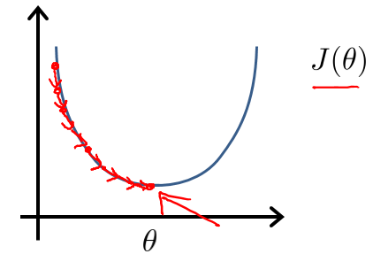

### Coursera机器学习笔记1-单变量线性回归
这是学习单变量的线性回归模型的笔记  
[TOC]
### 一. 理论
#### 1.1 训练集
假定给出一组数据:

| Population | Profit |
|------|---------|
|6.1101| 17.592 |
|5.5277|9.1302|
|8.5186|13.662|
|7.0032|11.854|

左侧是x, 右侧是实际值 y
### 1.2 基本定义 
#### 1.2.1 假设函数
第一步先通过最简单的模型<一条直线>来拟合,这就是机器学习的'hello,world',所以假设函数就是一条直线的方程式:   
Hypothesis: $h_\theta(x)=\theta_0+\theta_1x$  
**  <font color=#DC143C>敲黑板: </font>** 上式虽然是一个关于x的方程,但是机器学习中认为x是己知的,我们实际要做的是找到拟合最好参数的$\theta$  
那么如何求解这个Hypothesis中的两个参数$\theta$呢? 这就引出了Cost Function(损失函数)  
##### 补充: 关于假设函数的向量表示
Hypothesis: $h_\theta(x)=\theta_0+\theta_1x$  
可以写成这样的形式:即 $h_\theta(x)=\theta_0x_0+\theta_1x_1$,其中$x_0\equiv1$  
这样就可以把假设函数写成向量的形式: 即 $h_\theta(x)=$
$\left( \begin{matrix} \theta_0 \\ \theta_1 \end{matrix} \right) \left( x_0 x_1 \right)=\theta^T X$,其中$x_0\equiv1$
#### 1.2.2 损失函数(平方误差函数)
要使选择的$h_\theta(x)$最接近y的值，那么问题就转化成为求 $\sum\limits_{i=0}^{n}(h_\theta(x^{(i)})-y^{(i)})$的值最小的问题.   
这里引入Cost Function记作$J(\theta)$:  
$J\left( \theta  \right)=\frac{1}{2m}\sum\limits_{i=1}^{m}{{{\left( {{h}_{\theta }}\left( {{x}^{(i)}} \right)-{{y}^{(i)}} \right)}^{2}}}$  
其中：${{h}_{\theta }}\left( x \right)={{\theta }_{0}}{{x}_{0}}+{{\theta }_{1}}{{x}_{1}}={{\theta }^{T}}X$
#### 1.3 梯度下降算法
有了损失函数是解决了what的问题,即什么样的参数$\theta$是拟合最好的参数,  
那么下面就要解决how的问题,即如何找到拟合最好的$\theta$ 呢?  
  
设置一个初始值,从初始值开始按照梯度下降的方法,一步步的迭代直至找到最小值,这个梯度下降的算法也就是不断求偏导的过程  
所以$\theta$的更新公式就是: 
${{\theta }_{j}}:={{\theta }_{j}}-\alpha \frac{\partial }{\partial {{\theta }_{j}}}J\left( \theta  \right)$  
只有这个更新公式还是不够,要真正进行编码还要继续推导才行  
#### 1.4 推导过程
$\theta$的更新公式: ${{\theta }_{j}}:={{\theta }_{j}}-\alpha \frac{\partial }{\partial {{\theta }_{j}}}J\left( \theta  \right)$, 下面来看一下公式最后的偏导数部分是如何计算的    
己知: $J\left( \theta  \right)=\frac{1}{2m}\sum\limits_{i=1}^{m}{{{\left( {{h}_{\theta }}\left( {{x}^{(i)}} \right)-{{y}^{(i)}} \right)}^{2}} \tag{1}}$  
${{h}_{\theta }}\left( x \right)={{\theta }_{0}}{{x}_{0}}+{{\theta }_{1}}{{x}_{1}}={{\theta }^{T}}X \tag{2}$
那么对公式$(1)$求偏导  
$\frac{\partial}{\partial\theta_j} J(\theta)=\frac{\partial}{\partial\theta_j} \left(\frac{1}{2m}\sum\limits_{i=1}^{m}{{\left( {{h}_{\theta }}\left( {{x}^{(i)}} \right)-{{y}^{(i)}} \right)}^{2}} \right)=$  
$\left(\frac{1}{2m}*2\sum\limits_{i=1}^{m}{{\left( {{h}_{\theta }}\left( {{x}^{(i)}} \right)-{{y}^{(i)}} \right)}} \right)*$
$\frac{\partial}{\partial\theta_j}{{\left( {{h}_{\theta }}\left( {{x}^{(i)}} \right)-{{y}^{(i)}} \right)}}$  
将$(2)$的${h}_{\theta }$代入得到  
$\frac{\partial}{\partial\theta_j} J(\theta)=$
$\left(\frac{1}{2m}*2\sum\limits_{i=1}^{m}{{\left( {{h}_{\theta }}\left( {{x}^{(i)}} \right)-{{y}^{(i)}} \right)}} \right)*$
$\frac{\partial}{\partial\theta_j}{{\left( {{\theta }_{0}}{{x}_{0}^{(i)}}+{{\theta }_{1}}{{x}_{1}^{(i)}}-{{y}^{(i)}} \right)}}$   
所以当$j=0$时  
$\frac{\partial}{\partial\theta_0} J(\theta)=$
$\frac{1}{m}\sum\limits_{i=1}^{m}{{\left( {{h}_{\theta }}\left( {{x}^{(i)}} \right)-{{y}^{(i)}} \right)}} *x_0^{(i)}$  
所以当$j=1$时  
$\frac{\partial}{\partial\theta_1} J(\theta)=$
$\frac{1}{m}\sum\limits_{i=1}^{m}{{\left( {{h}_{\theta }}\left( {{x}^{(i)}} \right)-{{y}^{(i)}} \right)}} *x_1^{(i)}$  
#### 1.5 可编程的$\theta$更新过程
$\theta$的更新公式: ${{\theta }_{j}}:={{\theta }_{j}}-\alpha \frac{\partial }{\partial {{\theta }_{j}}}J\left( \theta  \right) \tag{3}$  
同时有当$j=0$时  
$\frac{\partial}{\partial\theta_0} J(\theta)=\frac{1}{m}\sum\limits_{i=1}^{m}{{\left( {{h}_{\theta }}\left( {{x}^{(i)}} \right)-{{y}^{(i)}} \right)}} *x_0^{(i)} \tag{4}$  
由上述$(3)$与$(4)$可以得出: 当$j=0$时,$\theta_0$的更新过程就是:  
${{\theta }_0}:={{\theta }_0}-\alpha \frac{1}{m}\sum\limits_{i=1}^{m}{{\left( {{h}_{\theta }}\left( {{x}^{(i)}} \right)-{{y}^{(i)}} \right)}} *x_0^{(i)} \tag{5} $  
### 二. 核心代码说明
#### 2.1 
```python
# 批量梯度下降
def gradientDescent(X, y, theta, alpha, iters):
    temp = np.matrix(np.zeros(theta.shape))
    parameters = int(theta.ravel().shape[1])
    # 下面这个for循环是对每组theta进行迭代
    for i in range(iters):
        error = (X * theta.T) - y
        for j in range(parameters):
            term = np.multiply(error, X[:, j])
            temp[0, j] = theta[0, j] - ((alpha / len(X)) * np.sum(term))
        theta = temp
    return theta
```
其中X,y与$\theta$的值如下所示:iters 是迭代次数1000次   
$X=\left( \begin{matrix} 1,  6.1101 \\ 1,5.5277 \\ 1,8.5186\\ 1, 7.0032 \end{matrix} \right)_{4*2}$
$y=\left( \begin{matrix} 17.592 \\ 9.1302 \\ 13.662 \\ 11.854 \end{matrix} \right)_{4*1}$
$\theta=\left( \begin{matrix} 0.0 \\ 0.0 \end{matrix} \right)_{2*1}$

#### 2.1.1 逐行说明
```python
error = (X * theta.T) - y 
```
即求的: $error={{h}_{\theta }}\left( {{x}^{(i)}} \right)-{{y}^{(i)}} $这是一个4*1的矩阵  
```python
term = np.multiply(error, X[:, j])
```
即求的: $term = {{\left( {{h}_{\theta }}\left( {{x}^{(i)}} \right)-{{y}^{(i)}} \right)}} *x_0^{(i)}$ 这还是一个4*1的矩阵
```python
temp[0, j] = theta[0, j] - ((alpha / len(X)) * np.sum(term))
```
np.sum(term)=$\sum\limits_{i=1}^{m}{{\left( {{h}_{\theta }}\left( {{x}^{(i)}} \right)-{{y}^{(i)}} \right)}} *x_0^{(i)}$

```python
for j in range(parameters):
    term = np.multiply(error, X[:, j])
    temp[0, j] = theta[0, j] - ((alpha / len(X)) * np.sum(term))
```
不论是计算$\theta_0$还是$\theta_1$都需要计算${{h}_{\theta }}\left( {{x}^{(i)}} \right)-{{y}^{(i)}} $,所以这儿的error只需要计算一次,然后在for循环中使用其结果即可


### 三. 全部代码
#### 3.1 全部代码
```python
#coding:utf-8
__author__ = 'wangcong'
import os
import numpy as np
import pandas as pd
import matplotlib.pyplot as plt

# 加载数据: 每行两个值,一个是x1,一个是Y
# 6.1101,17.592
# 5.5277,9.1302
# 8.5186,13.662
def loadDataSet():
    # 将数据从文档中加载进内存
    path = './ex1data1.txt'
    data = pd.read_csv(path, header=None, names=['Population', 'Profit'])
    # 插入一列全为1的x0
    data.insert(0, 'Ones', 1)
    # 将数据分割为x 与 y, 其中x包含两项(x0,x1)
    cols = data.shape[1]
    x = data.iloc[:, 0:cols - 1]  # x是所有行，去掉最后一列
    y = data.iloc[:, cols - 1:cols]  # y是所有行，最后一列
    # 将x与y都转为matrix 方便计算
    x = np.matrix(x.values)
    y = np.matrix(y.values)
    return data, x, y

# 批量梯度下降
def gradientDescent(X, y, theta, alpha, iters):
    temp = np.matrix(np.zeros(theta.shape))
    parameters = int(theta.ravel().shape[1])
    for i in range(iters):
        error = (X * theta.T) - y
        for j in range(parameters):
            term = np.multiply(error, X[:, j])
            temp[0, j] = theta[0, j] - ((alpha / len(X)) * np.sum(term))
        theta = temp
    return theta

# 画出结果
def plot_data(data, g):
    x = np.linspace(data.Population.min(), data.Population.max(), 100)
    f = g[0, 0] + (g[0, 1] * x)
    fig, ax = plt.subplots(figsize=(12,8))
    ax.plot(x, f, 'r', label='Prediction')
    ax.scatter(data.Population, data.Profit, label='Traning Data')
    ax.legend(loc=2)
    ax.set_xlabel('Population')
    ax.set_ylabel('Profit')
    ax.set_title('Predicted Profit vs. Population Size')
    plt.show()

if __name__ == '__main__':
    (data,x,y) = loadDataSet()
    theta = np.matrix(np.array([0,0]))
    print x.shape,  y.shape, theta.shape, theta.T.shape
    # 设置步长为0.01
    alpha = 0.01
    # 设置迭代次数为1000次
    iters = 1000
    theta  = gradientDescent(x, y, theta, alpha, iters)
    print theta
    plot_data(data, theta)
```


### 附录: 参考文献
[吴恩达机器学习Coursera](https://www.coursera.org/learn/machine-learning)  
<机器学习个人笔记完整版v4.51> by 黄海广 (大神啊!!!)   
黄大神的1.linear_regreesion_v1.ipynb
