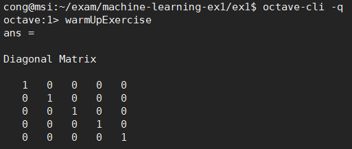
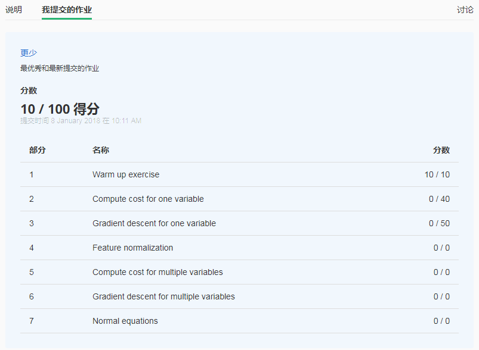

# Week 2 | 0_octive的安装及使用

### 一. 源码安装octive
环境: ubuntu 16.04 x64   
最终的解决方法,可直接看 **<font color=red> 下方1.3 </font>**
#### 1.1 直接用apt-get 安装版本不对
```python
cong@msi:~$ sudo apt-get install octave    
cong@msi:~$ octave-cli   
GNU Octave, version 4.0.0   
cong@msi:~$ sudo apt-get remove octave  
```
这样安装的是 octave 4.0.0版本, coursera 上不推荐用这个版本, 所以只好源码编译一个了  
#### 1.2 源码安装
##### 1.2.1 源码下载
```python
cong@msi:~/octave$ wget https://ftp.gnu.org/gnu/octave/octave-3.8.2.tar.gz
cong@msi:~/octave$ tar xf ./octave-3.8.2.tar.gz 
cong@msi:~/octave$ cd octave-3.8.2/
```
##### 1.2.2 在configure 之前安装依赖库
```python
cong@msi:~/octave/octave-3.8.2$ sudo apt-get build-dep octave
cong@msi:~/octave/octave-3.8.2$ sudo apt-get install libreadline6 libreadline6-dev
cong@msi:~/octave/octave-3.8.2/src$ sudo apt-get install libncurses-dev
```
##### 1.2.3 configure 
```python
cong@msi:~/octave/octave-3.8.2$ ./configure 
cong@msi:~/octave/octave-3.8.2$ make -j8
cong@msi:~/octave/octave-3.8.2$ sudo make install 
```
##### 1.2.4 octave-3.8.2的问题
用源码编译的octave-3.8.2版本,会在提交时出现:   
** error: support for url transfers was disabled when Octave was built **  
所以octave-3.8.2还是不行

### 1.3 最终解决方法 octave-4.2.1
```python
cong@msi:~$ sudo add-apt-repository ppa:octave/stable
cong@msi:~$ sudo apt-get update
cong@msi:~$ sudo apt-get install octave
```

#### 1.3.1 意外错误,正常情况下不会出现
像我一样上面安装了octave-3.8.2之后,再用apt-get install 安装会出现下面的问题:   
** error: couldn't read directory /usr/local/share/octave/packages: No such file or directory**  
解决方法是删掉以前安装的octave-3.8.2  
```python
cong@msi:~$ sudo rm -rf /usr/local/{bin,include,lib,libexec,share}/octave* 
cong@msi:~$ sudo rm -f  /usr/local/bin/mkoctfile* 
cong@msi:~$ sudo apt-get -f install 
# 这样安装的版本是 4.2.1
cong@msi:~$ octave-cli 
GNU Octave, version 4.2.1
```

### 1.4 验证一下
```python
cong@msi:~$ octave-cli
octave:1> A = [1 2  3]
octave:2> B=[4; 5; 6]
octave:3> A*B
ans =  32
```
### 1.5 win7 安装octave
下载octave: https://ftp.gnu.org/gnu/octave/windows/octave-4.2.1-w64-installer.exe   
双击安装即可,这个最简单了  

---
### 二. octive简单使用说明
#### 2.1 运行脚本
```python
cong@msi:~$ cd exam/machine-learning-ex1/ex1/
cong@msi:~/exam/machine-learning-ex1/ex1$ octave
octave:1> warmUpExercise   
```
在octave的命令行中将脚本输入即可运行脚本    

---
### 三. 提交作业的方法
#### 3.1 作业
##### 3.1.1 做作业
在下载的作为中,很友好的给了一个demo,就是 warmUpExercise.m  
并在ex1.pdf中给出了,这个作业的改法: 即在第12行加入 A=eye(5);  
运行结果如下所示,会打印一个5阶的单位矩阵:    


##### 3.1.2 提交作业
```python
进入作业目录,运行octave-cli
cong@msi:~/exam/machine-learning-ex1/ex1$ octave-cli -q
octave:1> submit  --> 执行这个就可以了
== Submitting solutions | Linear Regression with Multiple Variables...
Login (email address): test@163.com --> 这儿输入邮箱地址
Token: 1234567890123456     --> 这儿输入16位的Token就可以了
```
##### 3.1.3 查看作业
此时到 coursera 第2周的编程题中去查看"我提交的作业",就会显示当前的分数了

#### 3.2 作业说明
ex1.m 是一个总的框架,在octave中执行这个脚本就会显示作业1-5的结果  
<font color="red"> ** 需要通过图形界面登录,远程终端下是无法看到的 ** </font>  
同样 ex1_multi.m是可选部分的总的框架  
