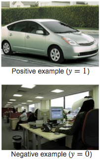
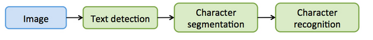
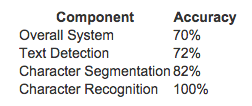

# Week11_1Application Photo OCR

### 第 1 题
Suppose you are running a sliding window detector to find text in images.  
Your input images are 1000x1000 pixels. You will run your sliding windows detector at two scales,  
10x10 and 20x20 (i.e., you will run your classifier on lots of 10x10 patches to decide if they contain text or not; 
and also on lots of 20x20 patches), and you will "step" your detector by 2 pixels each time.   
About how many times will you end up running your classifier on a single 1000x1000 test set image?  

* 500,000
* 1,000,000
* 100,000
* 250,000  
 ** &nbsp;&nbsp;&nbsp;&nbsp;答案: 1  **  
 ** 解析: 用滑动窗口去检测图像中的文字, 窗口大小是(10x10)或(20x20)一次滑动2个像素  **    
 ** 每个窗口滑动的次数是: (1000x1000)/(2x2)=250,000  因为有两个窗口, 所以需要再乘以2  **    

---
### 第 2 题
Suppose that you just joined a product team that has been developing a machine learning application, using training examples. 
You discover that you have the option of hiring additional personnel to help collect and label data.  
You estimate that you would have to pay each of the labellers $10 per hour, 
and that each labeller can label 4 examples per minute. 
About how much will it cost to hire labellers to label 10,000 new training examples?

* $400  
* $600   
* $250  
* $10,000  

 ** &nbsp;&nbsp;&nbsp;&nbsp;答案: 1  **  
 **解析: 1分钟4个lable, 则1小时4x60=240个lable,10,000个lable, 需要10000/240=41.66小时  **   
 **1小时\$10,则42小时花\$420, 答案中只有\$400最接近  **   

---
### 第 3 题
What are the benefits of performing a ceiling analysis? Check all that apply.  

* It is a way of providing additional training data to the algorithm.  
* It helps us decide on allocation of resources in terms of which component in a machine learning pipeline to spend more effort on.  
* It can help indicate that certain components of a system might not be worth a significant amount of work improving, 
  because even if it had perfect performance its impact on the overall system may be small.
* If we have a low-performing component, the ceiling analysis can tell us if that component has a high bias problem or a high variance problem.

 ** &nbsp;&nbsp;&nbsp;&nbsp;答案: 2 3 **  
 ** 选项1: 使用上限分析并没有增加训练样本. 不正确 **   
 ** 选项2: 使用上限分析能帮助我们分析流水线的哪个部分对整个系统的提高最大. 正确  **   
 ** 选项3: 使用上限分析能让我们知道到某个模块需不需要花精力做好;因为就算把这个模块精度提高到100%了,也无助于提高整个系统的精度. 正确 **   
 ** 选项4: 使用上限分析并不会帮我们分析出哪个部分是high bias,哪个部分是high variance. 不正确 **   

---
### 第 4 题
Suppose you are building an object classifier, that takes as input an image,  
and recognizes that image as either containing a car ($y=1$) or not ($y=0$).  
For example, here are a positive example and a negative example:  
   
After carefully analyzing the performance of your algorithm,   
you conclude that you need more positive ($y=1$) training examples.   
Which of the following might be a good way to get additional positive examples?

* Apply translations, distortions, and rotations to the images already in your training set.
* Select two car images and average them to make a third example.
* Take a few images from your training set, and add random, gaussian noise to every pixel.
* Make two copies of each image in the training set; this immediately doubles your training set size.

 ** &nbsp;&nbsp;&nbsp;&nbsp;答案:  1 **  
 ** 你做了一个物体检测程序,识别图像中有没有car. 经过认真检查,你需要更多的训练样本. 下面哪一个方法是增加正确样本的途径  **   
 ** 选项1: 对己有的训练样本进行一些增加变形 扭曲 旋转的处理,生成新的训练样本. 手动创造大量的样本. 正确  **  

---
### 第 5 题
Suppose you have a PhotoOCR system, where you have the following pipeline:  
  
You have decided to perform a ceiling analysis on this system, and find the following:  
   
Which of the following statements are true?  

* There is a large gain in performance possible in improving the character recognition system.
* Performing the ceiling analysis shown here requires that we have ground-truth labels for the text detection, character segmentation and the character recognition systems.
* The least promising component to work on is the character recognition system, since it is already obtaining 100% accuracy.
* The most promising component to work on is the text detection system, since it has the lowest performance (72%) and thus the biggest potential gain.

 ** &nbsp;&nbsp;&nbsp;&nbsp;答案: 1 2 **  
 ** 解析: 你做了一个图像中文字识别系统, 经过pipline的四步进行处理. 然后做了一个ceiling analysis分析:  **   
 ** Text detection 对整个系统有2%的提升 **  
 ** Character segmentation 对整个系统有10%的提升 **   
 ** Character recognition 对整个系统有18%的提升 **   
 ** 选项1: 当提高Character recognition时会对整个文字识别系统有较大的提升. 正确 **  
 ** 选项2: 要用这儿提到的上限分析(ceiling analysis),需要我们对其它的三个流程都加上标签来判断对错(ground-truth). 正确 **  
 ** 选项3: Character recognition 会有18%的提升. 不正确 **  
 ** 选项4: Text detection 会有2%的提升. 不正确 **  
