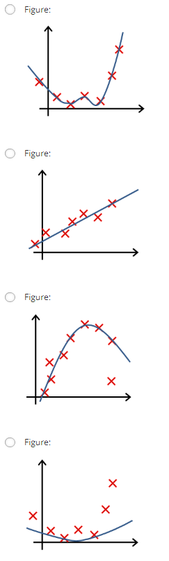
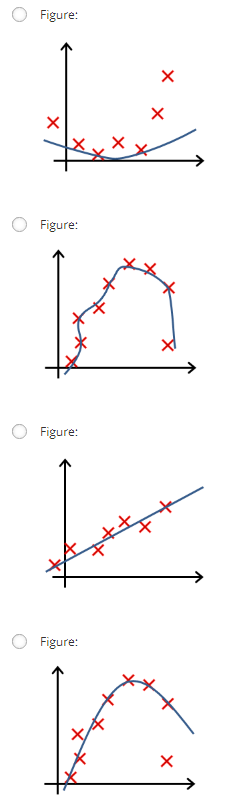

# Week3_2Regularization

### 第 1 题
You are training a classification model with logistic 
regression. Which of the following statements are true? Check
all that apply.

* Introducing regularization to the model always results in equal or better performance on the training set. 
* Adding many new features to the model helps prevent overfitting ont the training set.
* Introducing regularization to the model always results in equal or better performance on examples not in the training set.
* Adding a new feature to the model always results in equal or better performance on the training set.  
 ** &nbsp;&nbsp;&nbsp;&nbsp;答案: 4  **  
正则化方法的公式: $J( \theta)=\frac{1}{2m} \left[\sum\limits_{i=1}^{m}{{\left( {{h}_{\theta }}( {{x}^{(i)}} )-{{y}^{(i)}} \right)}^{2}} + \lambda \sum\limits_{i=1}^{n}\theta_j^2 \right]$  
**   * 选项1: 将正则化方法加入模型并不是每次都能取得好的效果,如果$\lambda$取得太大的化就会导致欠拟合. 这样不论对traing set 还是 examples都不好. 不正确   **  
**   * 选项2: more features能够更好的fit 训练集,同时也容易导致overfit,是more likely而不是prevent. 不正确    **  
**   * 选项3: 同1,将正则化方法加入模型并不是每次都能取得好的效果,如果$\lambda$取得太大的化就会导致欠拟合. 这样不论对traing set 还是 examples都不好. 不正确   **  
**   * 选项4: 新加的feature会提高train set的拟合度,而不是example拟合度. 正确   **  

---
### 第 2 题
Suppose you ran logistic regression twice, once with $\lambda = 0$, and once with $\lambda = 1$.  
One of the times, you got parameters $\theta = \begin{bmatrix} 81.47 \\ 12.69 \end{bmatrix}$, and the other time you got $\theta = \begin{bmatrix} 13.01 \\ 0.91 \end{bmatrix}$.  
However, you forgot which value of λ corresponds to which value of θ. Which one do you think corresponds to λ=1?

* $\theta = \begin{bmatrix} 13.01 \\ 0.91 \end{bmatrix}$  
* $\theta = \begin{bmatrix}  81.47 \\ 12.69 \end{bmatrix}$  
**  &nbsp;&nbsp;&nbsp;&nbsp;答案: 1   **  
**   加入$\lambda$会让$\theta$变小，当$\lambda$非常非常大时,$\theta_1 \theta_2 ... \theta_n \thickapprox 0$ 所以选择 $\theta = \begin{bmatrix} 13.01 \\ 0.91 \end{bmatrix}$  **

--- 
### 第 3 题
Which of the following statements about regularization are true? Check all that apply.  

* Using too large a value of λ can cause your hypothesis to overfit the data; this can be avoided by reducing λ.
* Using a very large value of λ cannot hurt the performance of your hypothesis; the only reason we do not set λ to be too large is to avoid numerical problems.
* Consider a classification problem. Adding regularization may cause your classifier to incorrectly classify some training examples (which it had correctly classified when not using regularization, i.e. when λ=0).
* Because logistic regression outputs values 0≤hθ(x)≤1, its range of output values can only be "shrunk" slightly by regularization anyway, so regularization is generally not helpful for it.  
 ** &nbsp;&nbsp;&nbsp;&nbsp;答案: 3 **  
正则化方法的公式: $J( \theta)=\frac{1}{2m} \left[\sum\limits_{i=1}^{m}{{\left( {{h}_{\theta }}( {{x}^{(i)}} )-{{y}^{(i)}} \right)}^{2}} + \lambda \sum\limits_{i=1}^{n}\theta_j^2 \right]$  
  
**   * 选项1: $\lambda$太大导致overfit不对,是underfit,当$\lambda$太大时$\theta_1 \theta_2 ... \theta_n \thickapprox 0$.只有$\theta_0$起作用,拟合出来是一条直线. $\lambda$太小才会导致overfit. 不正确   **  
**   * 选项2: 同1. 不正确    **  
**   * 选项3: 当$\lambda$没有选择好时,可能会导致训练效果还不如不加的$\lambda$好. 正确   **  
**   * 选项4:  "shrunk" slightly的是$\theta$,  regularization是想要解决overfit. 不正确   **  

--- 
### 第 4 题
In which one of the following figures do you think the hypothesis has overfit the training set?  
  
 ** &nbsp;&nbsp;&nbsp;&nbsp;答案: 1 **  

### 第 5 题
In which one of the following figures do you think the hypothesis has underfit the training set?  
  
 ** &nbsp;&nbsp;&nbsp;&nbsp;答案: 1 **  