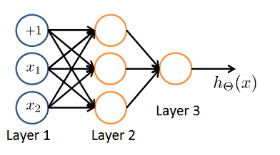

# Week4_1Neural Networks Representation

### 第 1 题
Which of the following statements are true? Check all that apply.

* The activation values of the hidden units in a neural network, with the sigmoid activation function applied at every layer, are always in the range (0, 1).
* Any logical function over binary-valued (0 or 1) inputs $x_1$ and $x_2$ can be (approximately) represented using some neural network.
* A two layer (one input layer, one output layer; no hidden layer) neural network can represent the XOR function.
* Suppose you have a multi-class classification problem with three classes, trained with a 3 layer network. Let a(3)1=(hΘ(x))1 be the activation of the first output unit, and similarly $a^{(3)}_2 = (h_\Theta(x))_2$ and $a^{(3)}_3 = (h_\Theta(x))_3$. Then for any input x, it must be the case that $a^{(3)}_1 + a^{(3)}_2 + a^{(3)}_3 = 1$.

**  &nbsp;&nbsp;&nbsp;&nbsp;答案: 1 2  **  
**   * 选项1: sigmoid激励层的取值范围都是(0-1). 正确   **  
**   * 选项2: logical function有四种操作:AND OR XOR NOT. 其中两层的Network可以表示出AND OR NOT这三类,三层Network可以表示出XOR. 正确    **  
**   * 选项3: 要实现xor操作须要有一个hidden layer. 不正确   **  
**   * 选项4: 计算三个分类中每一个分类的期望,最理想的情况才会出现类似1 0 0 0这种. 不正确  **

---
### 第 2 题
Consider the following neural network which takes two binary-valued inputs $x_1, x_2 \in \{0, 1\}$ and outputs $h_\Theta(x)$. Which of the following logical functions does it (approximately) compute?  

* OR
* AND
* NAND (meaning "NOT AND")
* XOR (exclusive OR)  
**  &nbsp;&nbsp;&nbsp;&nbsp;答案: 1  **  
**   $h_\theta= g(-20+30x_1+30x_2)$  **  

| $x_1$ | $x_2$ | $h_\theta$ |
|---|---|---|
| 0 | 0 | 0 |
| 1 | 0 | 1| 
| 0 | 1 |1 |
| 1 | 1 | 1|  

**   只要有一个为1,就为True, 这不就是OR嘛  **  

--- 
### 第 3 题
Consider the neural network given below. Which of the following equations correctly computes the activation $a_1^{(3)}$? Note: $g(z)$ is the sigmoid activation function.  

 * $a_1^{(3)} = g(\Theta_{1,0}^{(2)}a_0^{(2)} + \Theta_{1,1}^{(2)}a_1^{(2)} + \Theta_{1,2}^{(2)}a_2^{(2)})$
 * $a_1^{(3)} = g(\Theta_{1,0}^{(1)}a_0^{(1)} + \Theta_{1,1}^{(1)}a_1^{(1)} + \Theta_{1,2}^{(1)}a_2^{(1)})$
 * $a_1^{(3)} = g(\Theta_{1,0}^{(1)}a_0^{(2)} + \Theta_{1,1}^{(1)}a_1^{(2)} + \Theta_{1,2}^{(1)}a_2^{(2)})$
 * The activation $a_1^{(3)}$ is not present in this network.
 
** &nbsp;&nbsp;&nbsp;&nbsp;答案: 1   **  
**   $a_1^{(3)}$ 是第3层的第1个激活单元=第2层的$\Theta$ 乘以 第2层的a     **  
**   第2层的$\Theta$就是$\Theta^2$     **  
**   第2层的$a$就是$a^2$     **  

---

### 第 4 题
You have the following neural network:  
  
You'd like to compute the activations of the hidden layer $a^{(2)} \in \mathbb{R}^3$.   
One way to do so is the following Octave code:   
  
You want to have a vectorized implementation of this (i.e., one that does not use for loops). Which of the following implementations correctly compute $a^{(2)}$? Check all that apply.

* z = Theta1 * x; a2 = sigmoid (z);
* a2 = sigmoid (x * Theta1);
* a2 = sigmoid (Theta2 * x);
* z = sigmoid(x); a2 = sigmoid (Theta1 * z);
 
** &nbsp;&nbsp;&nbsp;&nbsp;答案: 1  **  
**   * 选项2:  sigmoid是最后一步, 同时是先 Theta1*x, 再sigmoid(z)  **  

---
### 第 5 题
You are using the neural network pictured below and have learned the parameters $\Theta^{(1)} = \begin{bmatrix} 1 & 1 & 2.4 \\ 1 & 1.7 & 3.2\end{bmatrix}$ (used to compute a(2)) and $\Theta^{(2)} = \begin{bmatrix} 1 & 0.3 & -1.2 \end{bmatrix}$ (used to compute $a^{(3)}$ as a function of $a^{(2)}$).   
Suppose you swap the parameters for the first hidden layer between its two units so $\Theta^{(1)} = \begin{bmatrix}1 & 1.7 & 3.2 \\1 & 1 & 2.4 \end{bmatrix}$ and also swap the output layer so $\Theta^{(2)} = \begin{bmatrix} 1 & -1.2 & 0.3 \end{bmatrix}$. How will this change the value of the output $h_\Theta(x)$?  
  

* It will stay the same.
* It will increase.
* It will decrease
* Insufficient information to tell: it may increase or decrease.

** &nbsp;&nbsp;&nbsp;&nbsp;答案: 1  **  
** &nbsp;&nbsp;&nbsp;&nbsp;当交换$\Theta^{(1)}$中的两行时,实际上就是交换了$a_2^{(2)}$ 与 $a_3^{(2)}$,
原先是 $a_1^{(2)}*0.3$+$a_2^{(2)}*(-1.2)$ 现在变为$a_2^{(2)}*(-1.2)+a_1^{(2)}*0.3$$ 没什么区别 **  

