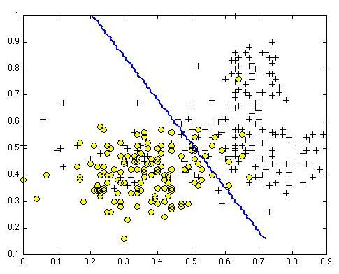
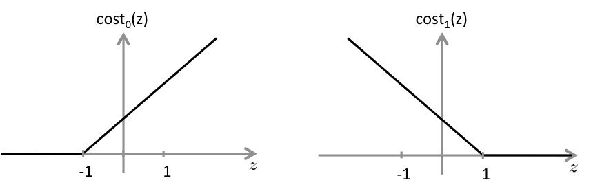

# Week7_1Support Vector Machinesg

### 第 1 题
Suppose you have trained an SVM classifier with a Gaussian kernel, and it learned the following decision boundary on the training set:  

  
You suspect that the SVM is underfitting your dataset. Should you try increasing or decreasing $C$? Increasing or decreasing $\sigma^2$?

* It would be reasonable to try decreasing $C$. It would also be reasonable to try increasing $\sigma^2$.
* It would be reasonable to try decreasing $C$. It would also be reasonable to try decreasing $\sigma^2$.
* It would be reasonable to try increasing $C$. It would also be reasonable to try increasing $\sigma^2$.
* It would be reasonable to try increasing $C$. It would also be reasonable to try decreasing $\sigma^2$.

**  &nbsp;&nbsp;&nbsp;&nbsp;答案: 4  **   
**  对于$C=\frac{1}{\lambda}$: Large C: Lower bias, high variance; Small C: High bias, Low variance  **  
**  对于$\sigma^2$: Large $\sigma^2$: High bias, Low variance; Small $\sigma^2$: Low bias, high variance  **  
${{h}_{\theta }}\left( x \right)=\min\limits_{\theta} C\sum\limits_{i=1}^{m}\left[y^{(i)}cost_1(\theta^T x^{(i)})+(1-y^{(i)})cost_0(\theta^Tx^{(i)})\right]+\frac{1}{2}\sum\limits_{i=1}^{n}\theta_j^2$  
**  目前处于underfitting(欠拟合)状态, 需要减小bias, 增大variance  ** 
 

---
### 第 2 题
The formula for the Gaussian kernel is given by $\text{similarity}(x,l^{(1)}) = \exp{(-\frac{||x-l^{(1)}||^2}{2\sigma^2})}$ .  
The figure below shows a plot of $f_1 = \text{similarity}(x,l^{(1)})$ when $\sigma^2 = 1$.    
   
Which of the following is a plot of $f_1$  when $\sigma^2 = 0.25$ ?

*     
*     
*     
*     

**  &nbsp;&nbsp;&nbsp;&nbsp;答案: 4 ** 
**  核函数为高斯时, 当减小$\sigma^2$时, less smoothly更陡了  **    

--- 
### 第 3 题
The SVM solves 
$\min_\theta \space C \sum_{i=1}^m y^{(i)} \text{cost}_1(\theta^Tx^{(i)}) + (1-y^{(i)}) \text{cost}_0(\theta^Tx^{(i)})  + \sum_{j=1}^n \theta_j^2$ where the functions $\text{cost}_0(z)$ and $\text{cost}_1(z)$ look like this:  
  
The first term in the objective is: $C \sum_{i=1}^m y^{(i)} \text{cost}_1(\theta^Tx^{(i)}) +  (1-y^{(i)}) \text{cost}_0(\theta^Tx^{(i)}).$  
This first term will be zero if two of the following four conditions hold true.   
Which are the two conditions that would guarantee that this term equals zero?

* For every example with $y^{(i)} = 1$, we have that $\theta^Tx^{(i)} \geq 1$.   
* For every example with $y^{(i)} = 0$, we have that $\theta^Tx^{(i)} \leq -1$.    
* For every example with $y^{(i)} = 1$, we have that $\theta^Tx^{(i)} \geq 0$.   
* For every example with $y^{(i)} = 0$, we have that $\theta^Tx^{(i)} \leq 0$. 

**  &nbsp;&nbsp;&nbsp;&nbsp;答案: 1 2  ** 
**  $y^{(i)} = 1$时, SVM solves的右半部分为0, 只看左半部分${cost}_1$.  **  
**  $y^{(i)} = 0$时, SVM solves的左半部分为0, 只看右半部分${cost}_0$.  **   

---
### 第 4 题
Suppose you have a dataset with n = 10 features and m = 5000 examples.  
After training your logistic regression classifier with gradient descent,   
you find that it has underfit the training set and does not achieve the desired performance on the training or cross validation sets.  
Which of the following might be promising steps to take? Check all that apply.  

* Try using a neural network with a large number of hidden units.  
* Reduce the number of examples in the training set.  
* Use a different optimization method since using gradient descent to train logistic regression might result in a local minimum.  
* Create / add new polynomial features.  

** &nbsp;&nbsp;&nbsp;&nbsp;答案: 1  4  **  
**  当使用逻辑回归出现欠拟合(underfitting)时,可以使用神经网络或者增加多项式的特征或者带有高斯核的支持向量机  **  

---
## 第 5 题
Which of the following statements are true? Check all that apply.

* Suppose you are using SVMs to do multi-class classification and would like to use the one-vs-all approach.   
   If you have $K$ different classes, you will train  $K$- 1 different SVMs.
* If the data are linearly separable, an SVM using a linear kernel will return the same parameters $\theta$ regardless of the chosen value of $C$ (i.e., the resulting value of $\theta$  does not depend on $C$).
* The maximum value of the Gaussian kernel (i.e., $sim(x, l^{(1)})$ ) is 1. 
* It is important to perform feature normalization before using the Gaussian kernel.

** &nbsp;&nbsp;&nbsp;&nbsp;答案: 3 4  **  
** 选项1: 三分类时,要训练三个SVMs, 所以这儿的$K-1$不对应该是$K$ different SVMs  **  
** 选项2: 当C大或者小都会影响SVM的分类$C=\frac{1}{\lambda}$  **  
 

