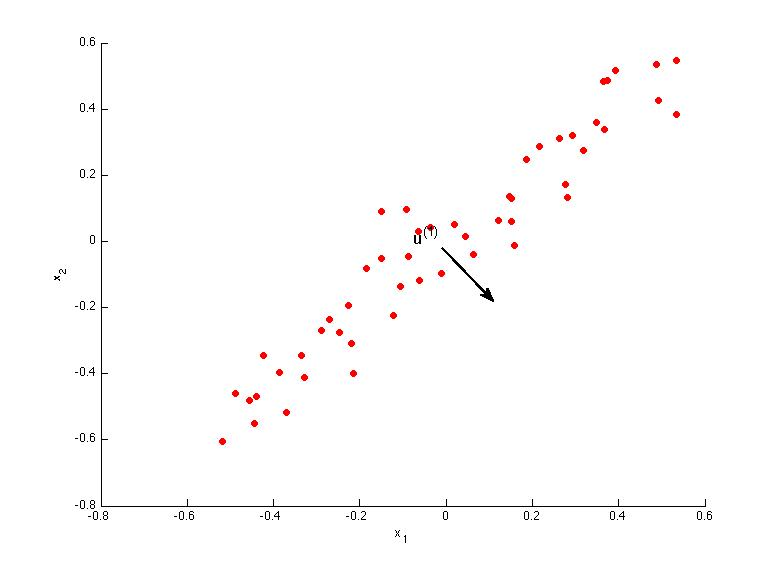

# Week8_2Principal Component Analysis

### 第 1 题
Consider the following 2D dataset:  
  
Which of the following figures correspond to possible values that PCA may return for $u^{(1)}$ (the first eigenvector / first principal component)? Check all that apply (you may have to check more than one figure).  

*    
*    
*    
*    

**  &nbsp;&nbsp;&nbsp;&nbsp;答案: 1 2   **   
**  minimize the projection error:要找到投影距离最小的向量,是1和2,方向正还是负都是可以的.  **   

---
### 第 2 题
Which of the following is a reasonable way to select the number of principal components $k$ ?  
(Recall that $n$ is the dimensionality of the input data and $m$ is the number of input examples.)  

* Choose k to be the smallest value so that at least 99% of the variance is retained.
* Choose the value of k that minimizes the approximation error $\frac{1}{m} \sum_{i=1}^m ||x^{(i)} - x^{(i)}_{\rm approx}||^2$.
* Choose k to be the smallest value so that at least 1% of the variance is retained. 
* Choose k to be 99% of n (i.e., $k = 0.99*n$, rounded to the nearest integer).

**  &nbsp;&nbsp;&nbsp;&nbsp;答案:  1  **   
**  选项1: . 正确  **   
**  选项1: . 正确  **   
**  选项1: . 正确  **   
**  选项1: . 正确  **   

--- 
### 第 3 题
Suppose someone tells you that they ran PCA in such a way that "95% of the variance was retained." What is an equivalent statement to this?

* $\frac{\frac{1}{m} \sum_{i=1}^m ||x^{(i)}||^2}{\frac{1}{m} \sum_{i=1}^m ||x^{(i)}- x^{(i)}_{\rm approx}||^2} \geq 0.05$  
* $\frac{\frac{1}{m} \sum_{i=1}^m ||x^{(i)}||^2}{\frac{1}{m} \sum_{i=1}^m ||x^{(i)}- x^{(i)}_{\rm approx}||^2} \leq 0.05$  
* $\frac{ \frac{1}{m} \sum_{i=1}^m ||x^{(i)}- x^{(i)}_{\rm approx}||^2}{\frac{1}{m} \sum_{i=1}^m ||x^{(i)}||^2} \leq 0.05$  
* $\frac{\frac{1}{m} \sum_{i=1}^m ||x^{(i)}||^2}{\frac{1}{m} \sum_{i=1}^m ||x^{(i)}- x^{(i)}_{\rm approx}||^2} \leq 0.95$    

**  &nbsp;&nbsp;&nbsp;&nbsp;答案: 3   **   
**  选项1: . 正确  **   
**  选项1: . 正确  **   
**  选项1: . 正确  **   
**  选项1: . 正确  **   

---
### 第 4 题
Which of the following statements are true? Check all that apply.  

*  Given only $z^{(i)}$ and $U_{\rm reduce}$, there is no way to reconstruct any reasonable approximation to $x^{(i)}$.  
*  Even if all the input features are on very similar scales, we should still perform mean normalization (so that each feature has zero mean) before running PCA.  
*  PCA is susceptible to local optima; trying multiple random initializations may help.  
*  Given input data $x \in \mathbb{R}^n$, it makes sense to run PCA only with values of k that satisfy $k \le n$. (In particular, running it with $k = n$ is possible but not helpful, and $k > n$ does not make sense.)   

**  &nbsp;&nbsp;&nbsp;&nbsp;答案: 2 4   **   
**  选项1: . 正确  ** 

---
## 第 5 题
Which of the following are recommended applications of PCA? Select all that apply.

* As a replacement for (or alternative to) linear regression: For most learning applications, PCA and linear regression give substantially similar results. 
* Data compression: Reduce the dimension of your data, so that it takes up less memory / disk space. 
* Data visualization: To take 2D data, and find a different way of plotting it in 2D (using k=2).  
* Data compression: Reduce the dimension of your input data $x^{(i)}$, which will be used in a supervised learning algorithm (i.e., use PCA so that your supervised learning algorithm runs faster).

**  &nbsp;&nbsp;&nbsp;&nbsp;答案: 2 4   **   
**  选项1: . 正确  ** 
