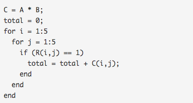

# Week9_2Recommender Systems
[TOC]
### 第 1 题
Suppose you run a bookstore, and have ratings (1 to 5 stars) of books. Your collaborative filtering algorithm has learned  
a parameter vector $\theta^{(j)}$ for user j, and a feature vector $x^{(i)}$ for each book. You would like to compute the  
"training error", meaning the average squared error of your system's predictions on all the ratings that you have gotten  
from your users. Which of these are correct ways of doing so (check all that apply)?  
For this problem, let m be the total number of ratings you have gotten from your users.   
(Another way of saying this is that $m = \sum_{i=1}^{n_m} \sum_{j=1}^{n_u} r(i,j)$. [Hint: Two of the four options below are correct.]   
* $\frac{1}{m} \sum_{j=1}^{n_u} \sum_{i:r(i,j)=1} (( \theta^{(j)})_i x^{(i)}_j - y^{(i,j)}  )^2$  
* $\frac{1}{m} \sum_{j=1}^{n_u} \sum_{i:r(i,j)=1} ( \sum_{k=1}^n (\theta^{(j)})_k x^{(i)}_k - y^{(i,j)}  )^2$  
* $\frac{1}{m} \sum_{(i,j):r(i,j)=1} \sum_{k=1}^n (( \theta^{(j)})_k x^{(i)}_k - y^{(i,j)}  )^2$   
* $\frac{1}{m} \sum_{(i,j):r(i,j)=1} (\sum_{k=1}^n (\theta^{(j)})_k x^{(i)}_k - y^{(i,j)}  )^2$  
**  &nbsp;&nbsp;&nbsp;&nbsp;答案: 2 4  --> 这个答案是正确的 ** 

---
### 第 2 题
In which of the following situations will a collaborative filtering system be the most appropriate learning algorithm (compared to linear or logistic regression)?  

* You run an online bookstore and collect the ratings of many users. You want to use this to identify what books are "similar" to each other (i.e., if one user likes a certain book, what are other books that she might also like?)  
* You manage an online bookstore and you have the book ratings from many users. You want to learn to predict the expected sales volume (number of books sold) as a function of the average rating of a book.  
* You're an artist and hand-paint portraits for your clients. Each client gets a different portrait (of themselves) and gives you 1-5 star rating feedback, and each client purchases at most 1 portrait. You'd like to predict what rating your next customer will give you. 
* You own a clothing store that sells many styles and brands of jeans. You have collected reviews of the different styles and brands from frequent shoppers, and you want to use these reviews to offer those shoppers discounts on the jeans you think they are most likely to purchase  

**  &nbsp;&nbsp;&nbsp;&nbsp;答案:  1 4 &nbsp;&nbsp; 选出协同过滤系统适合的场景  **   
**  选项1: 你经营一家在线书店,你要去这个算法去判断哪些书是同一类的. 书的种类与特征都很多不可能用logistic去一一处理,用协同很好. 正确  **  
**  选项2: 你经营一家在线书店, 你要对某一类书的销量作预测.这个跟房价的预测是一样的用logistic. 不正确  **  
**  选项3: 你是一个艺术大师,为顾客画肖像,每个顾客最多买1个消像并反馈1-5分,你要预测下一个用户的评分. 不正确  **   
**  选项4: 你经营一家服装店,卖各种款式与品牌的jeans,你从经常购买的人群中收集了他们对不同款式与品牌的反馈,你要利用这些反馈来给那些最可能卖出去的jeans打折. 正确  **  

--- 
### 第 3 题
You run a movie empire, and want to build a movie recommendation system based on collaborative filtering.   
There were three popular review websites (which we'll call A, B and C) which users to go to rate movies,   
and you have just acquired all three companies that run these websites.  
You'd like to merge the three companies' datasets together to build a single/unified system.   
On website A, users rank a movie as having 1 through 5 stars. On website B, users rank on a scale of 1 - 10,   
and decimal values (e.g., 7.5) are allowed. On website C, the ratings are from 1 to 100.   
You also have enough information to identify users/movies on one website with users/movies on a different website.   
Which of the following statements is true?

* You can merge the three datasets into one, but you should first normalize each dataset's ratings (say rescale each dataset's ratings to a 0-1 range).    
* You can combine all three training sets into one as long as your perform mean normalization and feature scaling after you merge the data.  
* Assuming that there is at least one movie/user in one database that doesn't also appear in a second database, there is no sound way to merge the datasets, because of the missing data.  
* It is not possible to combine these websites' data. You must build three separate recommendation systems.  

**  &nbsp;&nbsp;&nbsp;&nbsp;答案:  1   **   
**  选项1: . 正确  **   
 

---
### 第 4 题
Which of the following are true of collaborative filtering systems? Check all that apply.

* Recall that the cost function for the content-based recommendation system is $J(\theta) = \frac{1}{2} \sum_{j=1}^{n_u} \sum_{i:r(i,j) =1} \left( (\theta^{(j)})^Tx^{(i)} - y^{(i,j)} \right)^2  + \frac{\lambda}{2} \sum_{j=1}^{n_u} \sum_{k=1}^n (\theta_k^{(j)})^2$. Suppose there is only one user and he has rated every movie in the training set. This implies that $n_u = 1$ and $r(i,j) = 1$ for every i,j. In this case, the cost function $J(\theta)$ is equivalent to the one used for regularized linear regression.
* When using gradient descent to train a collaborative filtering system, it is okay to initialize all the parameters ($x^{(i)}$ and $\theta^{(j)}$) to zero.  
* If you have a dataset of users ratings' on some products, you can use these to predict one user's preferences on products he has not rated.  
* To use collaborative filtering, you need to manually design a feature vector for every item (e.g., movie) in your dataset, that describes that item's most important properties.  
**  &nbsp;&nbsp;&nbsp;&nbsp;答案: 1 3   **   
**  选项1: 如果只有一个样本，那么协同过滤算法的代价函数与线性回归是一样的. 正确  **   
**  选项2: 不能都为0. 不正确  **   
**  选项3: 可以使用协同过滤算法对用户没有估计过的产品进行预测. 正确  **   
**  选项4: 使用协同过滤算法可以同时学习用户参数与电影的特征,并不需要手动指定哪个特征是最重要的. 不正确  **   

---
### 第 5 题
Suppose you have two matrices $A$ and $B$, where $A$ is 5x3 and $B$ is 3x5. Their product is C=AB, a 5x5 matrix. Furthermore, you have a 5x5 matrix R where every entry is 0 or 1. You want to find the sum of all elements C(i,j) for which the corresponding R(i,j) is 1, and ignore all elements $C(i,j)$ where $R(i,j)=0$. One way to do so is the following code:  
  
Which of the following pieces of Octave code will also correctly compute this total? Check all that apply. Assume all options are in code.  

* total = sum(sum((A * B) .* R))  
* C = A * B; total = sum(sum(C(R == 1)));  
* C = (A * B) * R; total = sum(C(:));  
* total = sum(sum(A(R == 1) * B(R == 1));  

**  &nbsp;&nbsp;&nbsp;&nbsp;答案: 1 2 &nbsp;&nbsp; 点乘.\*: R(5x5) C(5x5),上图代码实现的就是: C .\* R   **   
**  区分 octave中的 * 与 .\*, * 是矩阵相乘, .\*是对应元素相乘 **   
**  $A = \begin{bmatrix} 1 & 2 \\ 3 & 4 \end{bmatrix} \quad B = \begin{bmatrix} 2 & 2 \\ 3 & 3 \end{bmatrix}$  **  
** 则$A*B=\begin{bmatrix} 8 & 8 \\ 18 & 18 \end{bmatrix} \quad A.*B=\begin{bmatrix} 8 & 8 \\ 18 & 18 \end{bmatrix}$   **  
** 选项1: C=A*B    C.\*R之后求和,就是代码中的值     **  

* total = sum(sum((A * B) .* R))  
* C = (A * B) .* R; total = sum(C(:));  
* total = sum(sum((A * B) * R));  
* C = (A * B) * R; total = sum(C(:));  

**  &nbsp;&nbsp;&nbsp;&nbsp;答案: 1 2    **   
