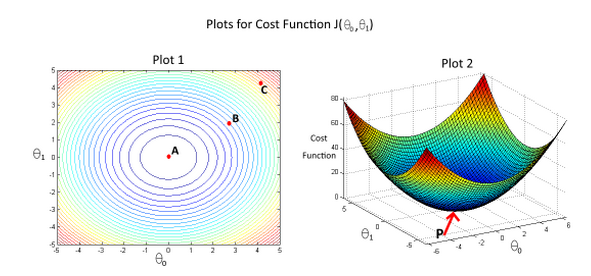

# Week 1 | 1_Linear Regression with One Variable
### 第 1 题
Consider the problem of predicting how well a student does in her second year of college/university, given how well she did in her first year.  
&nbsp;&nbsp;&nbsp;&nbsp;Specifically, let x be equal to the number of "A" grades (including A-. A and A+ grades) that a student receives in their first year of college (freshmen year). We would like to predict the value of y, which we define as the number of "A" grades they get in their second year (sophomore year).  
&nbsp;&nbsp;&nbsp;&nbsp;Here each row is one training example. Recall that in linear regression, our hypothesis is $h_\theta(x) = \theta_0 + \theta_1x$, and we use m to denote the number of training examples.  

| x | y |
|---|---|
| 3 | 2 |
| 1 | 2 |
| 0 | 1 |
| 4 | 3 |  

&nbsp;&nbsp;&nbsp;&nbsp;For the training set given above (note that this training set may also be referenced in other questions in this quiz), what is the value of $m$? In the box below, please enter your answer (which should be a number between 0 and 10).  
** &nbsp;&nbsp;&nbsp;&nbsp;答案: 4  
&nbsp;&nbsp;&nbsp;&nbsp;解析: m=Number of traing examples,有几个样本,4个    **

---
### 第 2 题
For this question, assume that we are using the training set from Q1. Recall our definition of the cost function was $J(\theta_0, \theta_1) = \frac{1}{2m}\sum_{i=1}^m{(h_\theta(x^{(i)}) - y^{(i)})^2}$.  
&nbsp;&nbsp;&nbsp;&nbsp;What is $J(0,1)$? In the box below, please enter your answer (Simplify fractions to decimals when entering answer, and '.' as the decimal delimiter e.g., 1.5).  
**&nbsp;&nbsp;&nbsp;&nbsp;答案: 0.5  
&nbsp;&nbsp;&nbsp;&nbsp;解析: $\theta_0=0,\theta_1=1$,所以$h(\theta)=0+1*x=x$,所以   $J(0,1)=\frac{1}{2*4}\left((3-2)^2+(1-2)^2+(0-1)^2+(4-3)^2 \right)=0.5$   **

---
### 第 3 题 
Suppose we set $\theta_0=−1,\theta_1=2$ in the linear regression hypothesis from Q1. What is $h_{\theta}(6)$?  
** &nbsp;&nbsp;&nbsp;&nbsp;答案: 1  
&nbsp;&nbsp;&nbsp;&nbsp;解析: $h(\theta)=-1+2x$,所以将x=6代入得到 $h_{\theta}(6)=-1+2*6=11$   ** 

---
### 第 4 题 
In the given figure, the cost function $J(\theta_0,\theta_1)$  has been plotted against $\theta_0$ and $\theta_1$, as shown in 'Plot 2'. The contour plot for the same cost function is given in 'Plot 1'. Based on the figure, choose the correct options (check all that apply).

* If we start from point B, gradient descent with a well-chosen learning rate will eventually help us reach at or near point A, as the value of cost function $J(\theta_0,\theta_1)$ is minimum at A.
* Point P (The global minimum of plot 2) corresponds to point C of Plot 1.
* If we start from point B, gradient descent with a well-chosen learning rate will eventually help us reach at or near point C, as the value of cost function $J(\theta_0,\theta_1)$ is minimum at point C.
* If we start from point B, gradient descent with a well-chosen learning rate will eventually help us reach at or near point A, as the value of cost function $J(\theta_0,\theta_1)$ is maximum at point A.
* Point P (the global minimum of plot 2) corresponds to point A of Plot 1.

** &nbsp;&nbsp;&nbsp;&nbsp;答案: A D  
&nbsp;&nbsp;&nbsp;&nbsp;解析: 从B开始使用梯度下降算法最终会收敛到A点,所以选A而不选C     
P点是一个全局最小值,全局最小值在等高线上是中心A, 而不是边缘上的C, 所以选D而不选B  ** 

---
### 第 5 题 
Suppose that for some linear regression problem (say, predicting housing prices as in the lecture), we have some training set, and for our training set we managed to find some $\theta_0$, $\theta_1$ such that $J(\theta_0, \theta_1)=0$.  

Which of the statements below must then be true? (Check all that apply.)

* For this to be true, we must have $\theta_0=0$ and $\theta_1=0$  so that $h_\theta(x) = 0$

* For these values of $\theta_0$ and $\theta_1$ that satisfy $J(\theta_0, \theta_1) = 0$
we have that $h_\theta(x^{(i)}) = y^{(i)}$ for every training example $(x^{(i)}, y^{(i)})$

* This is not possible: By the definition of $J(\theta_0, \theta_1) = 0$, it is not possible for there to exist
$\theta_0$ and $\theta_1$  so that $J(\theta_0, \theta_1) = 0$

* We can perfectly predict the value of y even for new examples that we have not yet seen.
(e.g., we can perfectly predict prices of even new houses that we have not yet seen.)

**  &nbsp;&nbsp;&nbsp;&nbsp;答案: B  
&nbsp;&nbsp;&nbsp;&nbsp;解析:  
选项1: 我们的目的是找到 $\theta_0=0$ 和 $\theta_1=0$ 使得$J(\theta_0, \theta_1) = 0$,而不是 $h_\theta(x) = 0$  
选项2: 当完全拟合时,就会出现损失函数为0的情况. 正确   
选项3: B与C说法正好相反. 当完全拟合时,就会出现损失函数为0的情况  
选项4: 我们可以预测但是肯定会有一些情况下会有误差.用大体上估计,差不多等词是可以的,但不能perfectly predict 
 ** 