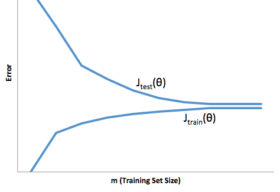

# Week6_1Advice for Applying Machine Learning

### 第 1 题
You train a learning algorithm, and find that it has unacceptably high error on the test set. You plot the learning curve, and obtain the figure below. Is the algorithm suffering from high bias, high variance, or neither?  

* High bias
* High variance
* Neither

**  &nbsp;&nbsp;&nbsp;&nbsp;答案: 1 high bias  **  
**   * 看刚开始的这一段,high bias(欠拟合)时,$J_{train(\theta)}$会很大,. 正确   **  
**   * 看刚开始的这一段,high variance(过拟合)时,$J_{train(\theta)}$会比较小.从这个地方就可以区分是 high bias 还是 high variance  **  

---
### 第 2 题
Suppose you have implemented regularized logistic regression to classify what object is in an image (i.e., to do object  
recognition). However, when you test your hypothesis on a new set of images, you find that it makes unacceptably large  
errors with its predictions on the new images. However, your hypothesis performs well (has low error) on the  
training set. Which of the following are promising steps to take? Check all that apply.  

* Try adding polynomial features.
* Get more training examples.
* Try using a smaller set of features.
* Use fewer training examples.

**  &nbsp;&nbsp;&nbsp;&nbsp;答案: 2 3 high variance  ** 
**  用正则化的logistic 回归算法去做图像识别, 训练样本拟合的很好,但是在真正测试时却发现误差很大 **  
**  过拟合, 可以增加样本或者减小特征数量  **  
**  过拟合, 补充选项中没有的 $\lambda$,这儿的$\lambda$太小导致对$\theta$惩罚的不够,可以增大$\lambda$  **  

--- 
### 第 3 题
Suppose you have implemented regularized logistic regression

to predict what items customers will purchase on a web

shopping site. However, when you test your hypothesis on a new

set of customers, you find that it makes unacceptably large

errors in its predictions. Furthermore, the hypothesis

performs poorly on the training set. Which of the

following might be promising steps to take? Check all that

apply.

* Try to obtain and use additional features.
* Try adding polynomial features.
* Try using a smaller set of features.
* Try increasing the regularization parameter $\lambda$.
 
**  &nbsp;&nbsp;&nbsp;&nbsp;答案: 1 2  high bias  ** 
**  用正则化的logistic 回归算法去预测顾客在购物网站上要买什么东西, 真正去预测时发现误差很大, 同时训练样本本身就拟合的不好 **  
**  欠拟合, 增加特征数量  **  

---
### 第 4 题
Which of the following statements are true? Check all that apply.

* Suppose you are training a regularized linear regression model. The recommended way to choose what value of regularization parameter $\lambda$ to use is to choose the value of $\lambda$ which gives the lowest cross validation error. 
* Suppose you are training a regularized linear regression model. The recommended way to choose what value of regularization parameter $\lambda$ to use is to choose the value of $\lambda$ which gives the lowest test set error.
* Suppose you are training a regularized linear regression model.The recommended way to choose what value of regularization parameter $\lambda$ to use is to choose the value of $\lambda$ which gives the lowest training set error. 
* The performance of a learning algorithm on the training set will typically be better than its performance on the test set.
 
** &nbsp;&nbsp;&nbsp;&nbsp;答案: 1  4  **  
**   * 选项2:  sigmoid是最后一步, 同时是先 Theta1*x, 再sigmoid(z)  **  

---
### 第 5 题
第 5 个问题
Which of the following statements are true? Check all that apply.

* When debugging learning algorithms, it is useful to plot a learning curve to understand if there is a high bias or high variance problem.
* If a learning algorithm is suffering from high variance, adding more training examples is likely to improve the test error. 
* We always prefer models with high variance (over those with high bias) as they will able to better fit the training set.
* If a learning algorithm is suffering from high bias, only adding more training examples may not improve the test error significantly.

** &nbsp;&nbsp;&nbsp;&nbsp;答案: 1 2 4  **  
** &nbsp;&nbsp;&nbsp;&nbsp;当交换$\Theta^{(1)}$中的两行时,实际上就是交换了$a_2^{(2)}$ 与 $a_3^{(2)}$,
原先是 $a_1^{(2)}*0.3$+$a_2^{(2)}*(-1.2)$ 现在变为$a_2^{(2)}*(-1.2)+a_1^{(2)}*0.3$$ 没什么区别 **  

