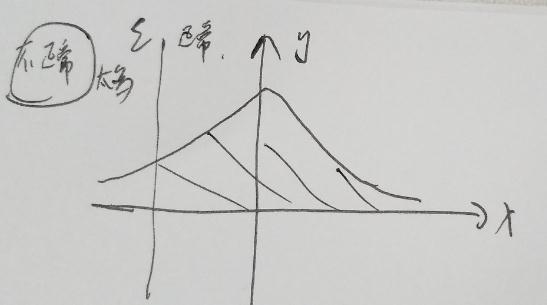
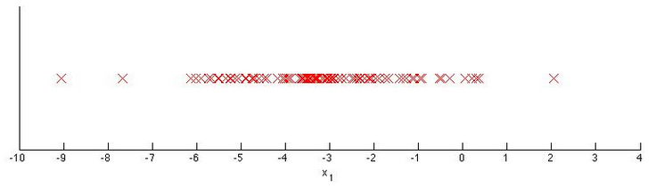

# Week9_1Anomaly Detection
[TOC]
### 第 1 题
For which of the following problems would anomaly detection be a suitable algorithm?

* Given an image of a face, determine whether or not it is the face of a particular famous individual. 
* Given a dataset of credit card transactions, identify unusual transactions to flag them as possibly fraudulent.  
* Given data from credit card transactions, classify each transaction according to type of purchase   
   (for example: food, transportation, clothing).  
* From a large set of primary care patient records, identify individuals who might have unusual health conditions.

**  &nbsp;&nbsp;&nbsp;&nbsp;答案: 2 4   **  
**  &nbsp;&nbsp;说明: anomaly detection 是通过高斯概率去判断的, 其中三西格玛准则:3$\sigma$ 0.9974,超过3$\sigma$认为是不正常.  **  
**  &nbsp;&nbsp;选项1: 通过人脸的照片,去判断这个脸是不是famous. 要判断必须得有所有的famous的人,不在这些famous的人里面就是非famous的人,即famous的人符合二项分布(只有0和1),不符合高斯分布. 不正确  **  
**  &nbsp;&nbsp;选项2: 给出刷卡记录来判断哪些是不正常的交易. 刷卡记录符合正态分布. 正确  **  
**  &nbsp;&nbsp;选项3: 给出刷卡记录来区分哪些交易用于食物 交通 及衣服.不能用于多分类.  不正确  **  
**  &nbsp;&nbsp;选项4: 给出病人的信息,区分哪些人有不寻常的病. 正常的病的概率+不正常的病的概率=100%, 并且正常与不正常的病不是事先知道,是统计完定个标准,例如认为在3$\sigma$内是正常的,在3$\sigma$外是不正常的. 正确  **  

---
### 第 2 题
Suppose you have trained an anomaly detection system that flags anomalies when $p(x)$ is less than $\varepsilon$, and you find on the cross-validation set that it has too many false positives (flagging too many things as anomalies). What should you do?

* Increase $\varepsilon$ 
* Decrease $\varepsilon$

**  &nbsp;&nbsp;&nbsp;&nbsp;答案: 2   **    
  
**  如上图所示, 阴影部分是正常的, 非阴影部分是不正常的,现在不正常的太多了,要增大阴影部分的面积怎么办? 不就是向左称动$\varepsilon$嘛,即减小$\varepsilon$  **

--- 
### 第 3 题
Suppose you are developing an anomaly detection system to catch manufacturing defects in airplane engines. You model uses  
$p(x) = \prod_{j=1}^n p(x_j ; \mu_j, \sigma^2_j).$   
You have two features $x_1$ = vibration intensity, and $x_2$ = heat generated.   
Both $x_1$ and $x_2$ take on values between 0 and 1 (and are strictly greater than 0),   
and for most "normal" engines you expect that $x_1 \approx x_2$. One of the suspected anomalies is that a flawed   
engine may vibrate very intensely even without generating much heat (large $x_1$, small $x_2$),   
even though the particular values of $x_1$ and $x_2$ may not fall outside their typical ranges of values.   
What additional feature $x_3$ should you create to capture these types of anomalies:   

* $x_3 = x_1^2 \times x_2$  
* $x_3 = \frac{x_1}{x_2}$  
* $x_3 = x_1 + x_2$  
* $x_3 = x_1 \times x_2$  

**  &nbsp;&nbsp;&nbsp;&nbsp;答案: 2  **  
**  &nbsp;&nbsp; 用正态分布去判断一个飞机引擎是正常的还是不正常的,现在选取了两个特征:振动强度
和产生的发热量,这两个特征的概率都在0-1之间,并且没有0值;对于正常的引擎来说,振动强度与产生的发热量是正相关的;但对于不正常的引擎振动强度很大但是发热量越很小,虽然不正常但是引擎振动强度也没有超出正常范围 **  
**  &nbsp;&nbsp; 关键点是: 正常时震动小发热量小;异常时震动小发热量大,所以出异常时这个比例值将会非常大,所以选2  **  
**  &nbsp;&nbsp; 关键点是: 不正常状况下:引擎振动强度也没有超出正常范围,所以用加乘都看不出异常来.  **  

---
### 第 4 题
Which of the following are true? Check all that apply.

* If you do not have any labeled data (or if all your data has label $y=0$), then is is still possible to learn $p(x)$, but it may be harder to evaluate the system or choose a good value of $\epsilon$.  
* If you have a large labeled training set with many positive examples and many negative examples, the anomaly detection algorithm will likely perform just as well as a supervised learning algorithm such as an SVM.  
* If you are developing an anomaly detection system, there is no way to make use of labeled data to improve your system.  
* When choosing features for an anomaly detection system, it is a good idea to look for features that take on unusually large or small values for (mainly the) anomalous examples.  
** &nbsp;&nbsp;&nbsp;&nbsp;答案: 1 4  **  
**    **  

---
### 第 5 题
You have a 1-D dataset $\{x^{(1)}, \ldots, x^{(m)}\}$ and you want to detect outliers in the dataset. You first plot the dataset and it looks like this:  
    
Suppose you fit the gaussian distribution parameters $\mu_1$ and $\sigma_1^2$ to this dataset. Which of the following values for $\mu_1$ and $\sigma_1^2$ might you get?  

* $\mu_1 = -3, \sigma_1^2 = 4$  
* $\mu_1 = -6, \sigma_1^2 = 4$  
* $\mu_1 = -3, \sigma_1^2 = 2$  
* $\mu_1 = -6, \sigma_1^2 = 2$

** &nbsp;&nbsp;&nbsp;&nbsp;答案: 1  **  
**  从图中可以看出$\mu_1 = -3$因为在-3处概率密度最大,感觉图画得不标准,但概率密度总比-6处大,所以$\mu_1$选-3 **  
**  再看$\sigma_1$: 1个$\sigma$的概率0.6826,2个是0.9544,3个是0.9974, 图中点的分布是在[-9, 2]之间  **  
**  3个是0.9974,, 当$\sigma_1$取2时正好包括所有的点  **  
**  3个是0.9974,图中的分布是在[-9, 2]之间, 当$\sigma_1$取$\sqrt2=1.414$时约在[-7.3, 1.3]之间则左右都会漏好几个点,则达不到0.9974的概率  **  