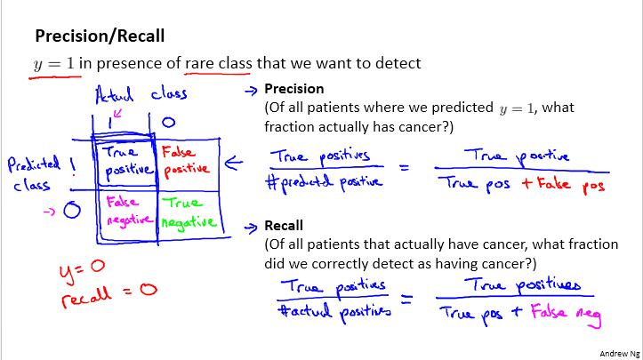

# Week9_3Program_Anomaly Detection and Recommender Systems编程解析
### 1. Anomaly detection分析
#### 1.1 Estimate gaussian parameters  0 / 15
计算公式:  
$\mu_i = \frac{1}{m}\sum\limits_{j=1}^{m}x_i^{(j)}$  
$\sigma_i^2 = \frac{1}{m}\sum\limits_{j=1}^{m} (x_i^{(j)}-\mu_i)^2$  
X=(300x2)  K=3  centroids=(3x2) idx=(300x1)  
在 estimateGaussian.m 中添加  
```python
mu = mean(X);
sigma2 = var(X,opt=1);
```   
octave中mean函数的作用:   
mean (x) = SUM_i x(i) / N
octave中的var函数的作用:  
var (x) = 1/(N-1) SUM_i (x(i) - mean(x))^2  

#### 1.2 Select threshold  0 / 15  
计算公式:   
$p(x; \mu, \sigma^2)=\frac{1}{\sqrt{2\pi\sigma^2}}e^{-\frac{(x-\mu)^2}{2\sigma^2}}$   
上述求p的过程己经在 multivariateGaussian.m 中完成了, 直接用就行,程序中是pval  
下面是 selectThreshold.m中用到的公式:  
$precison = \frac{tp+fp}{tp}$  
$recall = \frac{tp+fn}{tp}$  
$F_1 = \frac{prec+rec}{2*prec*rec}$  
  
上图是lecture 11中的课件截图  
<font color="red"> **  将距离u1最近的找出来,取个平均值作为新的u1 ** </font>    
```python
  predictions = (pval < epsilon);

  truePositives  = sum((predictions == 1) & (yval == 1));
  falsePositives = sum((predictions == 1) & (yval == 0));
  falseNegatives = sum((predictions == 0) & (yval == 1));

  precision = truePositives / (truePositives + falsePositives);
  recall = truePositives / (truePositives + falseNegatives);
  
  F1 = (2 * precision * recall) / (precision + recall);
```

### 2. Recommender Systems
#### 2.1  Collaborative filtering cost  0 / 20
计算公式:   
$J(x^{(1)},...,x^{(n_m)},\theta^{(1)},...,\theta^{(n_u)})=\frac{1}{2}\sum_{(i,j):r(i,j)=1}\left((\theta^{(j)})^Tx^{(i)}-y^{(i,j)}\right)^2$  

X(5x3)  $\theta$(4x3)  Y(5x4)  
在 cofiCostFunc.m 中添加, 实现没有正则化项的costFunction  
```python
error = (X*Theta'-Y) .* R;
J = (1/2)*sum(sum(error .^ 2));
```
#### 2.2  Collaborative filtering gradient  0 / 30
计算公式:   
$\frac{\partial J}{\partial x_k^{(i)}}=\sum\limits_{j:r(i,j)=1}\left( (\theta^{(j)})^T x^{(i)}-y^{(i,j)}   \right)\theta_k^{(j)}$  
$\frac{\partial J}{\partial \theta_k^{(j)}}=\sum\limits_{i:r(i,j)=1}\left( (\theta^{(j)})^T x^{(i)}-y^{(i,j)}   \right)x_k^{(i)}$  

```python
# 下面两行是2.1中添加的,计算costFunction   
error = (X*Theta'-Y) .* R;
J = (1/2)*sum(sum(error .^ 2)); 
# 下面两行是2.2中的,梯度下降计算  
X_grad = error * Theta ;
Theta_grad = error' * X ;
```

#### 2.3  Regularized cost  0 / 10  
计算公式:  
$JnoReg(x^{(1)},...,x^{(n_m)},\theta^{(1)},...,\theta^{(n_u)})=\frac{1}{2}\sum_{(i,j):r(i,j)=1}\left((\theta^{(j)})^Tx^{(i)}-y^{(i,j)}\right)^2$   
$reg = \frac{\lambda}{2}\sum\limits_{j=1}^{n_u}\sum\limits_{k=1}^{n}(\theta_k^{(j)})^2 + \frac{\lambda}{2}\sum\limits_{j=1}^{n_m}\sum\limits_{k=1}^{n}(x_k^{(j)})^2$  
$J = JnoReg + reg$  
```python
error = (X*Theta'-Y) .* R;
J_noReg = (1/2)*sum(sum(error .^ 2));
X_grad = error * Theta ;
Theta_grad = error' * X ;
# 下面实现正则化的costFunction
costRegLeft = lambda/2 * sum(sum(Theta.^2));
costRegRight = lambda/2 * sum(sum(X.^2));
Reg = costRegLeft + costRegRight;
J = J_noReg + Reg;
```
#### 2.4  Gradient with regularization  0 / 10
计算公式:   
$XgradnoReg=\frac{\partial J}{\partial x_k^{(i)}}=\sum\limits_{j:r(i,j)=1}\left( (\theta^{(j)})^T x^{(i)}-y^{(i,j)}   \right)\theta_k^{(j)}$  
$ThetagradnoReg=\frac{\partial J}{\partial \theta_k^{(j)}}=\sum\limits_{i:r(i,j)=1}\left( (\theta^{(j)})^T x^{(i)}-y^{(i,j)}   \right)x_k^{(i)}$  
$XReg = \lambda x_k^{(i)}$  
$ThetaReg = \lambda \theta_k^{(i)}$  
$ThetaGrad = Theta_grad_noReg + XReg$  
$ThetaGrad = Theta_grad_noReg + ThetaReg$  

```python
# 下面是计算costFuncton,分两步先计算不带cost的J,再计算reg项
error = (X*Theta'-Y) .* R;
J_noReg = (1/2)*sum(sum(error .^ 2));
costRegLeft = lambda/2 * sum(sum(Theta.^2));
costRegRight = lambda/2 * sum(sum(X.^2));
Reg = costRegLeft + costRegRight;
J = J_noReg + Reg;

# 下面是计算grad,分两步先计算不带reg的grad,再计算reg
X_grad_noReg = error * Theta ;
Theta_grad_noReg = error' * X ;

X_grad = X_grad_noReg + lambda * X;
Theta_grad = Theta_grad_noReg + lambda * Theta;
```
### 3. 总结
1 Estimate gaussian parameters  0 / 15
2 Select threshold  0 / 15
3 Collaborative filtering cost  0 / 20
4 Collaborative filtering gradient  0 / 30
5 Regularized cost  0 / 10
6 Gradient with regularization  0 / 10


